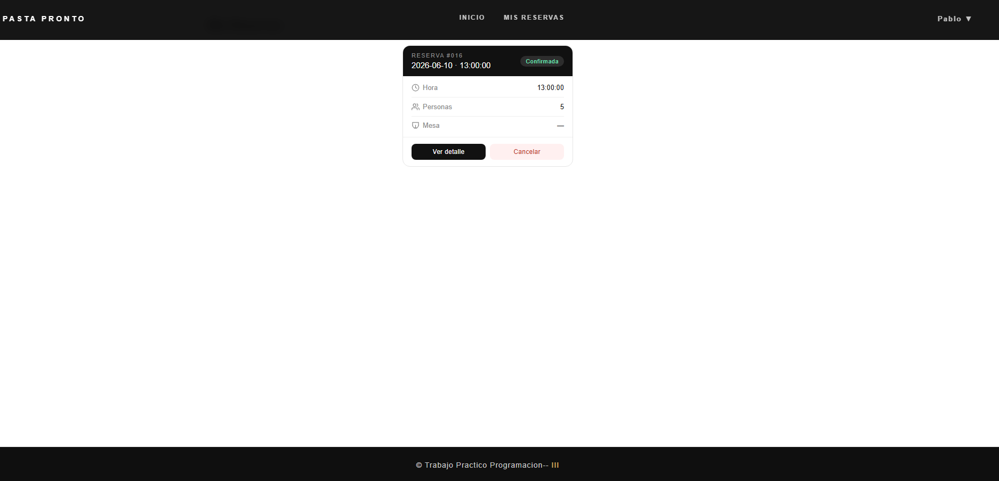
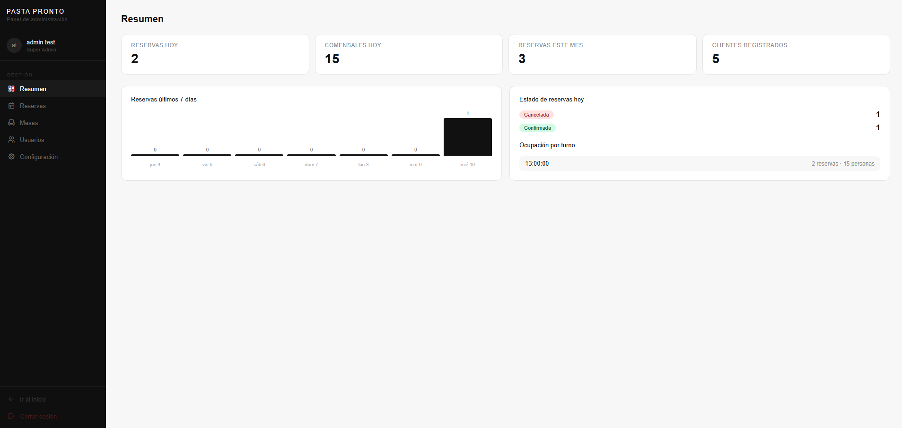
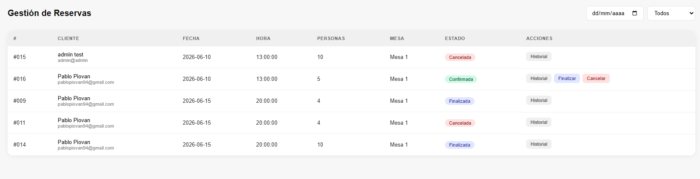

# 🍝 Pasta Pronto — Sistema de Reservas

Sistema web completo para la gestión de reservas de un restaurante. Incluye panel de cliente, panel de administración y panel de super administrador con control total del sistema.

---

## 📸 Screenshots

> **Página de inicio**
> 

> **Mis Reservas**
> 

> **Panel Admin — Resumen**
> 

> **Gestión de Reservas**
> 

---

## 🚀 Tecnologías utilizadas

**Frontend**
- React 18
- React Router DOM
- CSS puro (sin frameworks)

**Backend**
- Node.js
- Express
- Sequelize ORM
- MySQL

---

## ✨ Funcionalidades

### Cliente
- Registro e inicio de sesión con roles
- Reserva de mesa con **disponibilidad automática por turno**
- Visualización y cancelación de reservas activas
- Redirección automática según rol al iniciar sesión

### Admin
- Dashboard con métricas del día (reservas, comensales, ocupación por turno)
- Gráfico de reservas de los últimos 7 días
- Gestión completa de reservas (filtros, cambio de estado, asignación de mesa)
- Gestión de mesas (CRUD, activar/desactivar)
- Historial de movimientos por reserva

### Super Admin
- Todo lo del Admin
- Gestión de usuarios (editar, activar/desactivar, eliminar, cambiar rol)
- Configuración del restaurante (capacidad máxima, tolerancia en minutos)
- Gestión de turnos disponibles (agregar, activar/desactivar, eliminar)

---

## ⚙️ Instalación y uso

### Requisitos previos
- Node.js >= 18
- MySQL >= 8

### 1. Clonar el repositorio

```bash
git clone https://github.com/PPiovan/pasta-pronto.git
cd pasta-pronto
```

### 2. Configurar la base de datos

Importar el archivo SQL en MySQL Workbench:

```
database/sistema_reservas.sql
```

Insertar la configuración inicial del restaurante:

```sql
INSERT INTO configuracion_restaurante (capacidad_maxima, tolerancia_minutos, activo)
VALUES (30, 15, true);
```

### 3. Configurar el backend

```bash
cd backend
npm install
```

Crear un archivo `.env` en la carpeta `backend/`:

```env
DB_HOST=localhost
DB_PORT=3306
DB_NAME=sistema_reservas
DB_USER=root
DB_PASSWORD=tu_password
PORT=3000
```

Iniciar el servidor:

```bash
npm run dev
```

### 4. Configurar el frontend

```bash
cd frontend
npm install
npm run dev
```

La app estará disponible en `http://localhost:5173`

---

## 🗂️ Estructura del proyecto

```
pasta-pronto/
├── backend/
│   ├── controllers/
│   │   ├── auth/
│   │   ├── reservas/
│   │   ├── mesas/
│   │   ├── usuarios/
│   │   ├── configuracion/
│   │   └── dashboard/
│   ├── models/
│   ├── routes/
│   └── database/
├── frontend/
│   ├── src/
│   │   ├── components/
│   │   │   ├── admin/
│   │   │   ├── home/
│   │   │   ├── layouts/
│   │   │   └── reservas/
│   │   ├── context/
│   │   ├── pages/
│   │   ├── routes/
│   │   └── styles/
└── database/
    └── sistema_reservas.sql
```

---

## 🔐 Roles del sistema

| Rol | Acceso |
|-----|--------|
| Super Admin | Panel completo + configuración + usuarios |
| Admin | Panel de reservas + mesas |
| Cliente | Reservas propias |

---

## 🧠 Lógica de disponibilidad

Al crear una reserva el sistema:

1. Obtiene la capacidad máxima configurada
2. Suma los comensales ya reservados en ese turno y fecha
3. Si `total ocupado + nuevos comensales > capacidad máxima` → rechaza con mensaje
4. Si hay lugar → confirma automáticamente

---

## 👤 Autor

**Pablo Piovan**  
[GitHub](https://github.com/TU_USUARIO) · [LinkedIn](https://linkedin.com/in/TU_USUARIO)